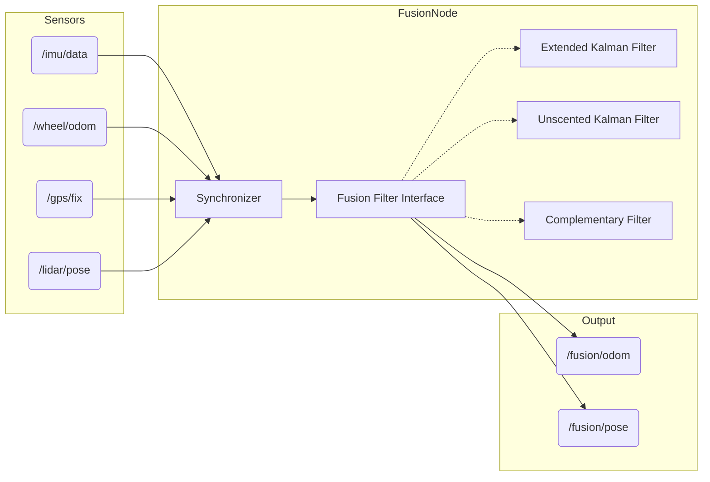

# Architecture: Sensor Fusion Lite

## Overview

The **Sensor Fusion Lite** library provides a modular way to fuse sensor data (IMU, Odometry, GPS, Pose) into a consistent state estimate. It is designed to be lightweight and easily extensible with custom filters.

## Data Flow

## Class Design

### Core
- **`FusionNode`**: The ROS 2 node that handles subscriptions, parameter updates, and publishing.
- **`FusionCore`**: The library class that manages the filter state and logic, independent of ROS 2 (mostly).

### Filters
All filters inherit from a base `FilterInterface` (conceptually, or via templates).

- **`ComplementaryFilter`**: Simple weight-based fusion for orientation.
- **`EKF`**: Extended Kalman Filter for non-linear state estimation.
- **`UKF`**: Unscented Kalman Filter for better handling of non-linearities without Jacobians.
