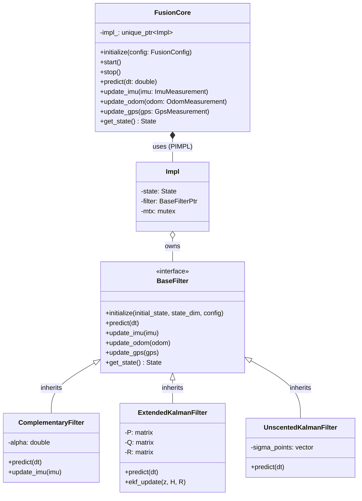
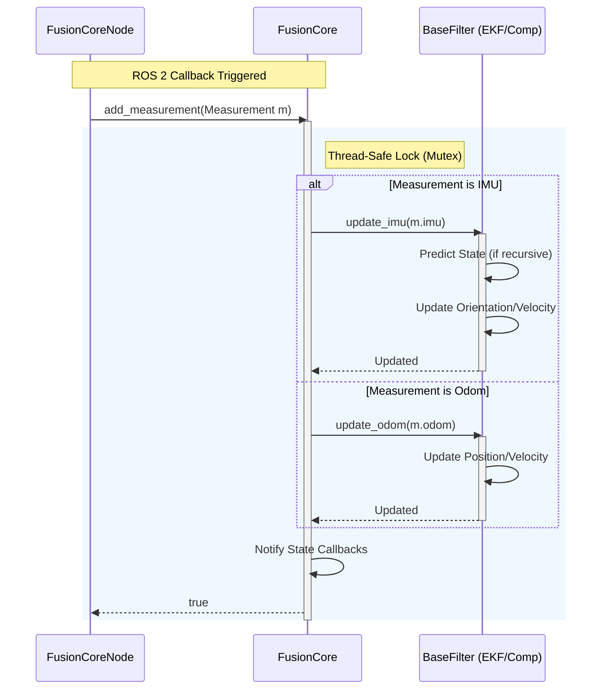

# Architecture: Sensor Fusion Lite

## Overview

The **Sensor Fusion Lite** library provides a modular way to fuse sensor data (IMU, Odometry, GPS, Pose) into a consistent state estimate. It is designed to be lightweight, thread-safe, and easily extensible with custom filters.

## Class Diagram

```mermaid
classDiagram
    class FusionCore {
        +initialize(config: FusionConfig)
        +start()
        +stop()
        +predict(dt: double)
        +update_imu(imu: ImuMeasurement)
        +update_odom(odom: OdomMeasurement)
        +update_gps(gps: GpsMeasurement)
        +get_state() State
        -impl_: unique_ptr~Impl~
    }

    class Impl {
        -state: State
        -filter: BaseFilterPtr
        -mtx: mutex
    }

    class BaseFilter {
        <<interface>>
        +initialize(initial_state, state_dim, config)
        +predict(dt)
        +update_imu(imu)
        +update_odom(odom)
        +update_gps(gps)
        +get_state() State
    }

    class ComplementaryFilter {
        -alpha: double
        +predict(dt)
        +update_imu(imu)
    }

    class ExtendedKalmanFilter {
        -P: matrix
        -Q: matrix
        -R: matrix
        +predict(dt)
        +ekf_update(z, H, R)
    }

    class UnscentedKalmanFilter {
        -sigma_points: vector
        +predict(dt)
    }

    FusionCore *-- Impl : uses (PIMPL)
    Impl o-- BaseFilter : owns
    BaseFilter <|-- ComplementaryFilter : inherits
    BaseFilter <|-- ExtendedKalmanFilter : inherits
    BaseFilter <|-- UnscentedKalmanFilter : inherits
```

## Sequence Diagram: Measurement Update Loop

```mermaid
sequenceDiagram
    participant Node as FusionCoreNode
    participant Core as FusionCore
    participant Filter as BaseFilter (EKF/Comp)

    Note over Node, Core: ROS 2 Callback Triggered

    Node->>Core: add_measurement(Measurement m)
    activate Core
    
    rect rgb(240, 248, 255)
    Note right of Core: Thread-Safe Lock (Mutex)
    
    alt Measurement is IMU
        Core->>Filter: update_imu(m.imu)
        activate Filter
        Filter->>Filter: Predict State (if recursive)
        Filter->>Filter: Update Orientation/Velocity
        Filter-->>Core: Updated
        deactivate Filter
    else Measurement is Odom
        Core->>Filter: update_odom(m.odom)
        activate Filter
        Filter->>Filter: Update Position/Velocity
        Filter-->>Core: Updated
        deactivate Filter
    end

    Core->>Core: Notify State Callbacks
    Core-->>Node: true
    end
    deactivate Core
```

## Data Types

### State
| Field | Type | Description |
| :--- | :--- | :--- |
| `position` | `double[3]` | x, y, z in meters |
| `velocity` | `double[3]` | vx, vy, vz in m/s |
| `orientation` | `double[4]` | Quaternion (x, y, z, w) |
| `covariance` | `double[][]` | State uncertainty matrix |

### Sensor Measurements
*   **ImuMeasurement**: `linear_accel`, `angular_vel`, `orientation`
*   **OdomMeasurement**: `position`, `velocity`, `covariance`
*   **GpsMeasurement**: `position` (lat/lon converted), `covariance`
